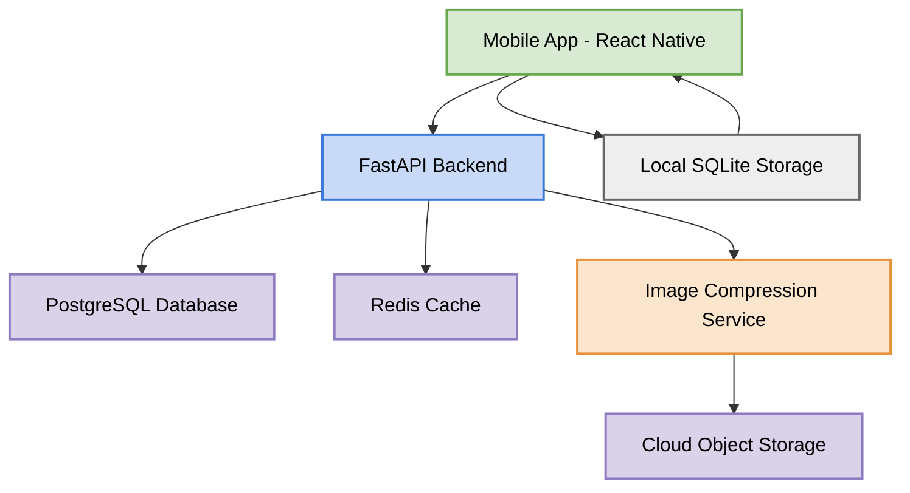

## Overview

House Finder is a lightweight, offline-first rental discovery platform designed for regions with:

* poor internet connectivity,
* fragmented rental information,
* and non-technical users.

The platform helps tenants quickly discover available rental houses nearby without physically walking around neighborhoods searching for vacancy signs.

Unlike traditional real estate platforms, House Finder focuses on:

* simplicity,
* speed,
* low data usage,
* and reliability on weak mobile networks.

The application enables:

* tenants to browse rental listings,
* landlords or caretakers to post available houses,
* and direct communication between both parties through phone calls or WhatsApp.

---

# Problem Statement

In many cities, especially across Africa, finding rental housing is still a highly manual process:

* tenants walk through neighborhoods searching for “House Available” signs,
* agents repeat the same information to multiple people,
* landlords lack digital visibility,
* and existing property apps are often too heavy or complicated.

This leads to:

* wasted transport costs,
* wasted time,
* poor rental visibility,
* and frustrating user experiences.

House Finder solves this by providing a lightweight digital rental discovery network optimized for low-connectivity environments.

---

# Goals

The primary goals of the platform are:

* Fast house discovery
* Extremely simple user experience
* Low mobile data consumption
* Offline-first browsing
* Reliable performance on weak internet
* Direct landlord communication
* Easy listing management

---

# Core Principles

## 1. Offline-First

The app should remain usable even with unstable internet connections.

Users must still be able to:

* open the app,
* view cached listings,
* browse favorites,
* and access recent searches offline.

---

## 2. Low Data Consumption

The application should minimize:

* API payload size,
* image sizes,
* unnecessary requests,
* and background activity.

---

## 3. Simplicity

Users should understand the app immediately without onboarding tutorials.

The interface should:

* avoid clutter,
* avoid complicated workflows,
* and minimize user decisions.

---

## 4. Reliability

The application must prioritize:

* fast loading,
* stable APIs,
* graceful failure handling,
* and efficient caching.

---

# Target Users

## Tenants

People searching for:

* apartments,
* studios,
* single rooms,
* shared apartments,
* or houses.

---

## Landlords

Property owners wanting to:

* advertise vacancies,
* receive direct calls,
* and quickly fill available spaces.

---

## Caretakers / Agents

People managing properties on behalf of landlords.

---

# MVP Features

# Tenant Features

## Browse Houses

Users can:

* view available listings,
* browse by neighborhood,
* and see pricing information.

---

## Search & Filter

Search filters include:

* location,
* price range,
* number of rooms,
* furnished/unfurnished.

---

## House Details

Each listing contains:

* images,
* rent amount,
* location,
* number of rooms,
* contact information,
* and basic property description.

---

## Direct Contact

Users can:

* call landlords directly,
* or contact them through WhatsApp.

No in-app messaging system is included initially.

---

## Favorites

Users can save listings locally for offline viewing.

---

## Recently Viewed

Recently opened listings remain accessible offline.

---

# Landlord Features

## Create Listing

Landlords can:

* upload photos,
* enter rental details,
* provide contact information,
* and publish listings.

---

## Manage Listings

Landlords can:

* update listing details,
* mark properties as rented,
* and remove inactive listings.

---

# Non-Goals (Initial Version)

The MVP intentionally excludes:

* online payments,
* booking systems,
* AI recommendations,
* advanced analytics,
* video uploads,
* social networking features,
* desktop applications,
* and complex mapping systems.

These features increase complexity and are not essential for validating the core product.

---

# Technology Stack

# Frontend

## Mobile Application

* React Native
* Expo

### Why?

* Single codebase for Android and iOS
* Fast development cycle
* Large ecosystem
* Good offline support

---

## Local Storage

* SQLite

### Used For

* cached listings,
* favorites,
* recent searches,
* offline browsing.

---

# Backend

## API Framework

* FastAPI

### Why?

* Lightweight
* High performance
* Easy API development
* Async support
* Excellent developer productivity

---

## Database

* PostgreSQL

### Why?

* Reliable relational database
* Good performance
* Geolocation support
* Scalability

---

## Cache Layer

* Redis

### Used For

* caching popular listings,
* reducing database load,
* improving API response times.

---

# Media Storage

## Image Storage

* Cloud object storage (S3-compatible)

### Strategy

Images are automatically compressed into:

* thumbnail,
* medium,
* optimized versions.

The mobile app initially loads only low-quality thumbnails to reduce bandwidth usage.

---

# System Architecture



---

# Offline-First Architecture

The application follows an offline-first approach.

## Cached Data

The mobile application stores:

* recent listings,
* saved listings,
* recently viewed properties,
* and search history locally.

---

## Synchronization Strategy

### When Online

* app syncs latest listings,
* updates favorites,
* refreshes cached data.

### When Offline

* app serves local cached content,
* queues pending actions,
* retries synchronization automatically.

---

# API Design Principles

The API must:

* remain lightweight,
* minimize payload size,
* support pagination,
* and avoid unnecessary nested data.

---

## Example Lightweight Response

```json
{
  "id": 12,
  "price": 75000,
  "rooms": 2,
  "location": "Biyem-Assi",
  "thumbnail": "thumb.jpg"
}
```

Detailed listing data should only load when a user opens a property.

---

# Suggested Folder Structure

# Mobile App

```plaintext
mobile-app/
├── src/
│   ├── components/
│   ├── screens/
│   ├── services/
│   ├── storage/
│   ├── hooks/
│   ├── navigation/
│   ├── utils/
│   └── assets/
```

---

# Backend

```plaintext
backend/
├── app/
│   ├── api/
│   ├── models/
│   ├── services/
│   ├── repositories/
│   ├── schemas/
│   ├── core/
│   ├── workers/
│   └── utils/
```

---

# Security Considerations

The application should include:

* rate limiting,
* input validation,
* image upload restrictions,
* authentication protection,
* and API throttling.

---

# Authentication

Initial authentication options:

* phone number login,
* OTP verification.

Reason:

* easier onboarding,
* better accessibility,
* avoids password complexity.

---

# Scalability Strategy

The platform should scale progressively:

## Phase 1

Single city deployment.

---

## Phase 2

Multiple neighborhoods.

---

## Phase 3

Multiple cities.

---

## Phase 4

National expansion.

---

# Performance Optimization

## Mobile

* aggressive caching,
* lazy image loading,
* pagination,
* minimal animations.

---

## Backend

* Redis caching,
* async processing,
* optimized SQL queries,
* CDN usage for images.

---

# Monitoring

Suggested monitoring tools:

* Sentry
* Prometheus
* Grafana

---

# Future Features

Potential future enhancements:

* landlord verification,
* push notifications,
* smart recommendations,
* map integration,
* rental analytics,
* premium featured listings,
* moving service partnerships.

---

# Monetization Strategy

Possible monetization methods:

* promoted listings,
* featured properties,
* verified landlord badges,
* agency subscriptions,
* advertising partnerships.

The MVP should prioritize growth and listing density over immediate monetization.

---

# Deployment Strategy

## Backend Hosting

* VPS or cloud instance
* Dockerized deployment

---

## Database Hosting

* Managed PostgreSQL

---

## Object Storage

* S3-compatible provider

---

## CDN

* image delivery optimization

---

# Development Phases

# Phase 1 — MVP

* authentication,
* property listing,
* browsing,
* filtering,
* favorites,
* offline cache,
* direct calls.

---

# Phase 2

* notifications,
* landlord verification,
* map support,
* analytics.

---

# Phase 3

* monetization,
* recommendations,
* scaling infrastructure.

---

# Success Metrics

The platform succeeds if users can:

* find houses faster,
* reduce transport costs,
* access listings with poor internet,
* and contact landlords easily.

Key metrics:

* daily active users,
* listing count,
* successful landlord contacts,
* user retention,
* app load speed.

---

# Vision

House Finder aims to become the most accessible and lightweight rental discovery platform optimized for emerging markets and low-connectivity environments.

The mission is to simplify rental discovery while making property visibility accessible to everyone.
